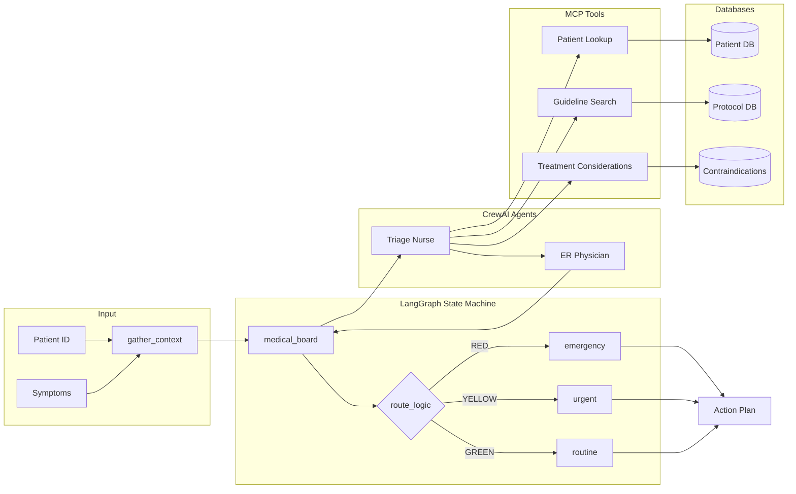

<p align="center">
  
</p>

<h1 align="center">PEAKWHALE™ TRIDENT</h1>

<p align="center">
  <strong>AI-Powered Medical Triage System with Multi-Agent Orchestration</strong>
</p>

<p align="center">
  <a href="#architecture">Architecture</a> •
  <a href="#features">Features</a> •
  <a href="#tech-stack">Tech Stack</a> •
  <a href="#installation">Installation</a> •
  <a href="#usage">Usage</a> •
  <a href="#how-it-works">How It Works</a>
</p>

<p align="center">
  
  
  
  
  
  
</p>

---

## Overview

**PEAKWHALE™ TRIDENT** is an intelligent medical triage system that combines state-machine orchestration with multi-agent AI collaboration to deliver accurate, protocol-compliant emergency assessments. The system retrieves patient history, analyzes symptoms against clinical protocols, considers treatment contraindications, and outputs actionable triage decisions.

### Key Capabilities

- **Protocol-Driven Decisions**: Strict adherence to clinical triage guidelines (RED/YELLOW/GREEN)
- **Patient History Integration**: Retrieves and analyzes medical history for treatment considerations
- **Contraindication Awareness**: Flags medication allergies and condition-specific cautions
- **Transparent Reasoning**: Full audit trail of agent decisions and tool invocations

---

## Architecture



---

## Tech Stack

| Technology | Purpose | Description |
|------------|---------|-------------|
|  | **Orchestration** | State machine for workflow management with conditional routing |
|  | **Multi-Agent** | Collaborative AI agents (Triage Nurse + ER Physician) |
|  | **Tool Protocol** | Model Context Protocol for structured tool interactions |
|  | **LLM Runtime** | Local Llama 3.1 8B inference |
|  | **API Layer** | High-performance async web framework |
|  | **Language** | Python 3.11+ with type hints |
|  | **Package Manager** | Fast, modern Python package management |

---

## Features

### Triage Protocols

| Level | Condition | Action |
|-------|-----------|--------|
| 🔴 **RED** | Chest pain with sweating/arm pain | Immediate emergency dispatch |
| 🟡 **YELLOW** | Fever, cough, respiratory symptoms | Urgent care referral |
| 🟢 **GREEN** | Localized rash, minor symptoms | Home care instructions |

### Treatment Considerations

The system analyzes patient history for:

- **Medication Allergies** (e.g., Penicillin → use Azithromycin instead)
- **Chronic Conditions** (e.g., Hypertension → avoid NSAIDs)
- **Previous Medical Events** (e.g., Prior stroke → rapid neuro assessment)

---

## Installation

### Prerequisites

- Python 3.11+
- [Ollama](https://ollama.ai/) with Llama 3.1 8B model
- [UV](https://github.com/astral-sh/uv) package manager

### Setup

```bash
# Clone the repository
git clone https://github.com/PeakWhale/trident.git
cd trident

# Install dependencies
uv sync

# Pull the Ollama model
ollama pull llama3.1:8b

# Start the server
uv run python main.py
```

### Quick Start

```bash
# Open in browser
open http://localhost:8000
```

---

## Usage

### Web Interface

1. Navigate to `http://localhost:8000`
2. Select a test scenario or enter custom patient data
3. Click **Analyze** to run the triage assessment
4. View the decision, protocol applied, and treatment considerations

### API Endpoint

```bash
curl -X POST http://localhost:8000/analyze \
  -H "Content-Type: application/json" \
  -d '{"patient_id": "P-101", "symptoms": "chest pain and sweating"}'
```

**Response:**
```json
{
  "patient_id": "P-101",
  "symptoms": "chest pain and sweating",
  "final_diagnosis": "RED",
  "action_plan": "EMERGENCY RESPONSE: Dispatch ambulance immediately (911)\n\n[PENICILLIN ALLERGY]\n  - AVOID: Penicillin, Amoxicillin, Ampicillin\n  - USE INSTEAD: Azithromycin or Fluoroquinolones"
}
```

---

## Project Structure

```
trident/
├── main.py                 # Application entry point
├── pyproject.toml          # Dependencies and project config
├── README.md               # This file
├── src/
│   ├── trident.py          # LangGraph workflow definition
│   ├── medical_crew.py     # CrewAI agents and tasks
│   ├── hospital_mcp.py     # MCP tools and databases
│   ├── llm_manager.py      # Ollama LLM configuration
│   └── server.py           # FastAPI application
└── static/
    ├── index.html          # Web UI
    ├── style.css           # Styling
    └── app.js              # Frontend logic
```

---

## How It Works

### 1. Context Gathering
```
Patient ID + Symptoms → gather_context node
                        ├── Retrieves patient record from Patient DB
                        └── Analyzes history for treatment considerations
```

### 2. Multi-Agent Analysis
```
medical_board node → CrewAI Sequential Process
                     ├── Triage Nurse (uses all 3 MCP tools)
                     │   ├── Patient Lookup → Patient DB
                     │   ├── Guideline Search → Protocol DB
                     │   └── Treatment Considerations → Contraindications
                     └── ER Physician (reviews and decides)
                         └── Outputs: RED | YELLOW | GREEN
```

### 3. Conditional Routing
```
route_logic → Reads final_diagnosis
              ├── RED → emergency node → "Dispatch Ambulance"
              ├── YELLOW → urgent node → "Refer to Urgent Care"
              └── GREEN → routine node → "Home Care Instructions"
```

### 4. Output Generation
```
Action Plan = Base Action + Treatment Considerations
              ├── Medication alternatives (for allergies)
              ├── Monitoring requirements (for chronic conditions)
              └── Special precautions (based on history)
```

---

## Test Scenarios

| Scenario | Patient | Symptoms | Expected |
|----------|---------|----------|----------|
| **Cardiac Emergency** | P-102 (82yo, stroke history) | Chest pain, sweating | 🔴 RED |
| **Respiratory Illness** | P-101 (45yo, hypertension) | Fever 101°F, cough | 🟡 YELLOW |
| **Minor Condition** | P-999 (25yo, healthy) | Skin rash from gardening | 🟢 GREEN |

---

## License

MIT License - see [LICENSE](LICENSE) for details.

---

<p align="center">
  <strong>PEAKWHALE™ TRIDENT</strong><br/>
  <sub>Intelligent Medical Triage • Multi-Agent AI • Protocol Compliance</sub>
</p>
